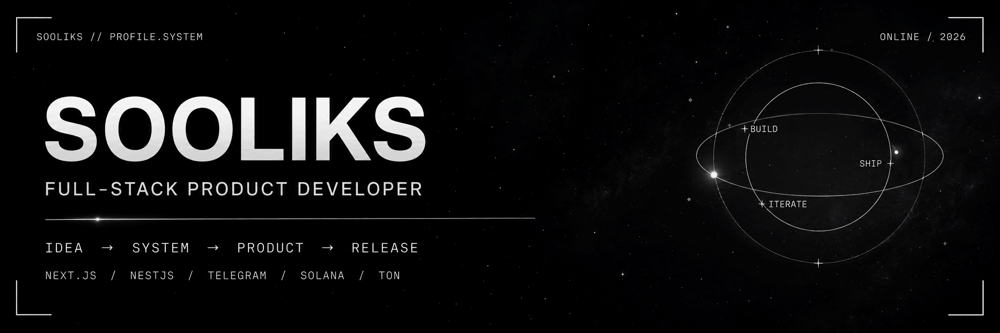

<p align="center">
  
</p>

<p align="center">
  <b>Web Products · Telegram Mini Apps · Web3 · Solana / TON · Realtime · Integrations</b>
</p>

<p align="center">
  <a href="https://sooliks.vercel.app/en">Portfolio ↗</a>
  &nbsp;&nbsp;·&nbsp;&nbsp;
  <a href="https://t.me/sooliks?direct=">Telegram ↗</a>
  &nbsp;&nbsp;·&nbsp;&nbsp;
  <a href="https://github.com/Sooliks?tab=repositories">Repositories ↗</a>
  &nbsp;&nbsp;·&nbsp;&nbsp;
  <code>OPEN TO SELECTED PROJECTS</code>
</p>

---

## `01 / ABOUT`

I build **complete digital products**, not isolated screens.

From **product structure and interface** to **backend architecture, data, payments, integrations, deployment and post-launch iteration** — the whole system is designed around one thing: **getting the user to a useful result with the least unnecessary friction**.

```text
DISCOVER    understand the real problem
DESIGN      shape the shortest useful flow
ENGINEER    connect frontend, backend, data and integrations
SHIP        release a production-ready system
ITERATE     improve it after real usage
```

> **The user's goal stays at the center. Everything else works around it.**

---

## `02 / STACK`

<p align="center">
  
</p>

<p align="center">
  
  
  
  
  
  
</p>

```text
FRONTEND      TypeScript / Next.js / React / Tailwind
BACKEND       NestJS / Node.js / Prisma / REST APIs
DATA          MongoDB / PostgreSQL
TELEGRAM      Bots / Mini Apps / Auth / Payments / Notifications
WEB3          Solana / TON / Wallets / Transactions / Payment Flows
SYSTEMS       Realtime / APIs / Automation / OBS / Integrations
ADDITIONAL    Python / C#
```

---

## `03 / WHAT I BUILD`

<table>
<tr>
<td width="33%" valign="top">

### `WEB`
Web products, landing pages, dashboards, SaaS interfaces, personal accounts and admin systems.

</td>
<td width="33%" valign="top">

### `TELEGRAM`
Bots and Mini Apps with auth, subscriptions, payments, notifications and usable user flows.

</td>
<td width="33%" valign="top">

### `WEB3`
Product interfaces around wallets, transactions, tokens and practical blockchain-based scenarios.

</td>
</tr>

<tr>
<td width="33%" valign="top">

### `SYSTEMS`
Architecture, APIs, business logic, integrations, realtime features and product workflows.

</td>
<td width="33%" valign="top">

### `PAYMENTS`
TON-oriented payment scenarios, Telegram-native flows and external provider integrations.

</td>
<td width="33%" valign="top">

### `DESKTOP`
Focused Python / C# utilities when desktop software is the better interface for the task.

</td>
</tr>
</table>

---

## `04 / SELECTED WORK`

### `VANTA HUD`
**Transparent Valorant HUD for OBS**  
Rank, RR and session statistics through a single browser source — without a dedicated OBS plugin.  
[Open product ↗](https://vantus-obs.vercel.app/)

### `SLX RUST TRACKER`
**Companion product for Rust**  
Live map, server events, Rust+ devices, alerts and team tooling built around real gameplay workflows.  
[Open product ↗](https://slxrust.com/)

### `PAYONTON`
**Telegram-native TON payments**  
Payment flows designed around Telegram and the TON ecosystem.  
[Open product ↗](https://payonton.site/)

### `WARFACE LINEUPS`
**Competitive map knowledge base**  
Fast access to positions, tactics and map workflows for team play.  
[Open product ↗](https://warfacelineups.vercel.app/)

<details>
<summary><b>More work</b></summary>
<br/>

**Sealit** — private file/message sharing experiment  
[Open product ↗](https://sealify.vercel.app/)

**ReverseRP** — large GTA V role-play project with custom mechanics, interfaces and economy systems  
[Open repository ↗](https://github.com/Sooliks/ReverseRP)

</details>

<p align="center">
  <a href="https://sooliks.vercel.app/en#projects"><b>View full portfolio ↗</b></a>
</p>

---

## `05 / ENGINEERING PRINCIPLES`

**Product > feature count**  
Build what moves the user toward the outcome.

**Clarity > cleverness**  
Simple UX and understandable architecture scale better than decorative complexity.

**Production > prototype**  
The critical path has to work under real conditions.

**Systems > isolated screens**  
Frontend, backend, data and integrations should behave like one product.

**Iteration > handoff**  
Release is a checkpoint, not the end.

---

## `06 / CURRENT SIGNAL`

```yaml
building:
  - full-stack web products
  - Telegram Mini Apps
  - Web3 products
  - payment and notification systems

focus:
  - product architecture
  - realtime systems
  - integrations
  - automation
  - launch-ready UX

ecosystems:
  - Telegram
  - Solana
  - TON

status: open_to_strong_product_ideas
```

---

## `07 / CONTACT`

**Have a product that should actually ship?**

Send the idea, the goal and the current state.

[**Write on Telegram ↗**](https://t.me/sooliks?direct=)  
[**Open portfolio ↗**](https://sooliks.vercel.app/en)

<br/>

<p align="center">
  <code>BUILD USEFUL THINGS // SHIP THEM // IMPROVE THEM</code>
</p>
